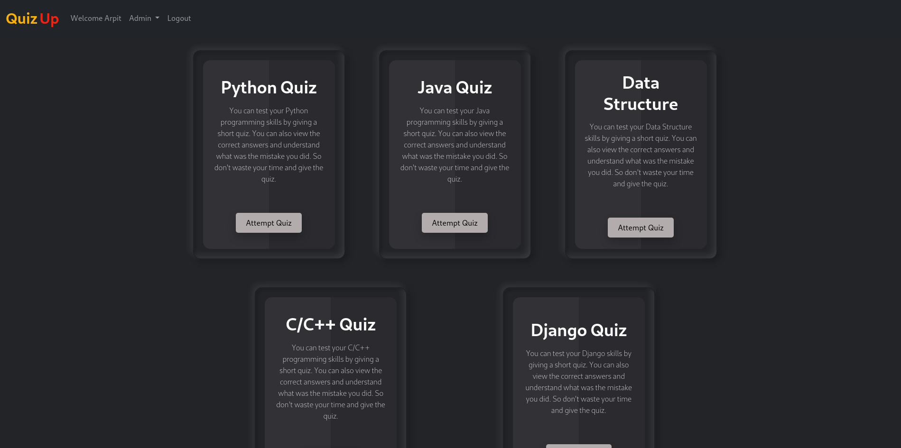
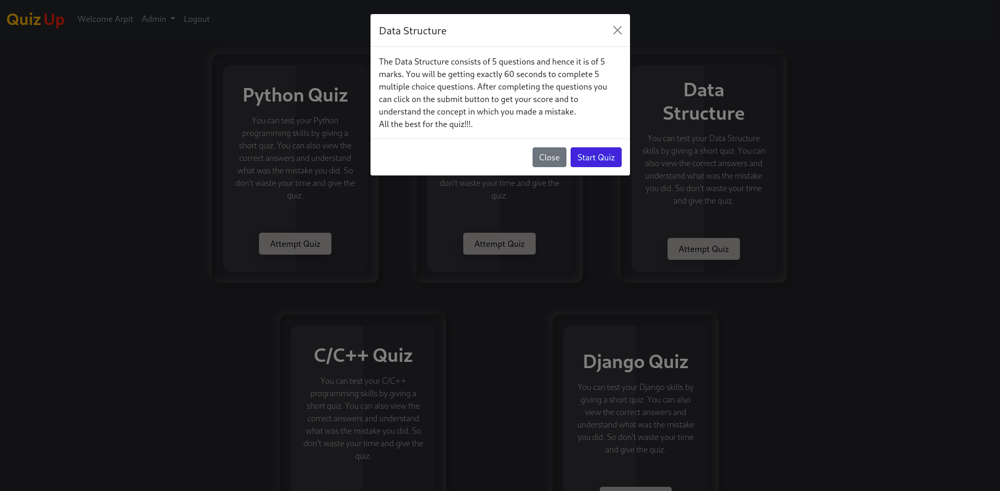
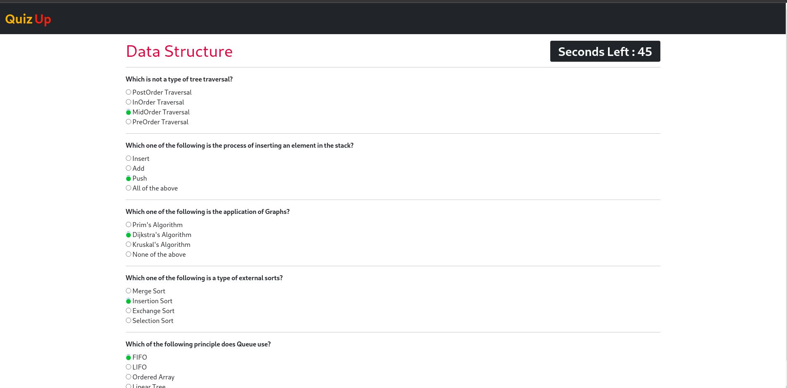
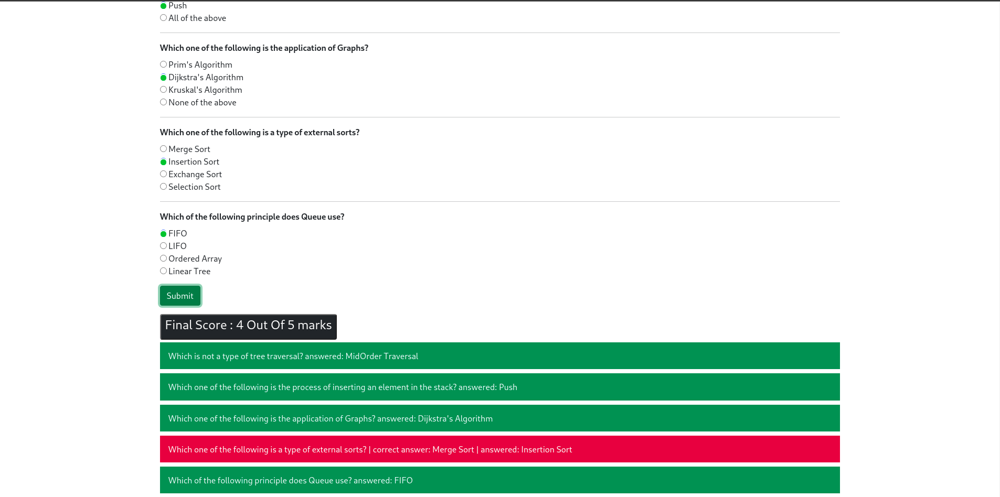
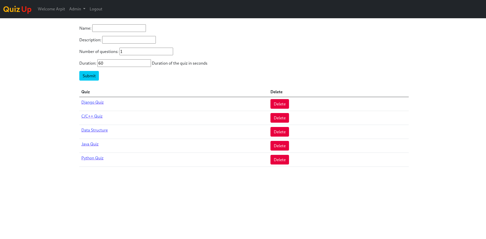
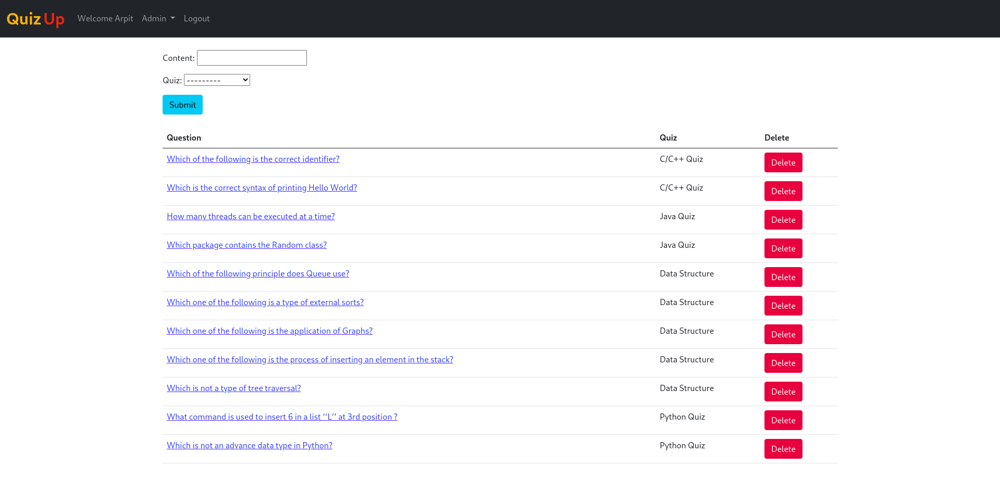

# Django based Quiz app

Quiz app based on Django framework, javascript, jQuery and ajax where user can register and 
test his/her knowledge in various topics. Admin user can manage quizzes and see the result of all the users.

## Features

- Login and Register option
- Give quiz of your favourite topic to test your knowledge
- Count down timer to give quiz in perticular time limit
- See the result of given quiz and also see the correct answers of all the questions
- Admin user can add/delete quizzes and questions
- Admin user can see the historic results of all the users

## Website preview

### Home page


### Attempt quiz page


### Quiz page


### Result page


### Add quiz page (Admin user)


### Add questions page (Admin user)


## Installation

quiz-app requires [Django](https://www.djangoproject.com/download/) v3.2.x to run.

Install the dependencies start the server.

```sh
python manage.py runserver
```
> Go to localhost:8000

## License
This project is licensed under the MIT License - see the [LICENSE.md](./LICENSE.md) file for details.
